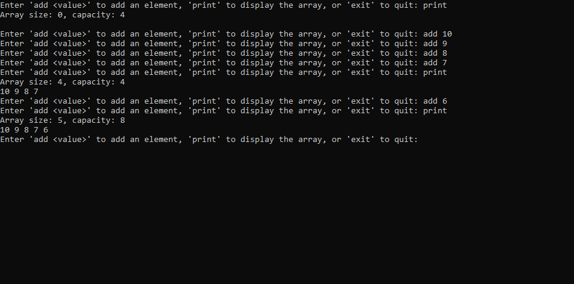

# FlexAlloc

Single-file header library in C written for Windows. The idea is based on the [malloc() and free() are a bad API](https://www.foonathan.net/2022/08/malloc-interface/) article by [Jonathan Müller](https://github.com/foonathan).

## The idea

In the said article, the problems of malloc and free were mentioned and a `better interface` was defined like this:

```c
struct memory_block
{
    void* ptr;
    size_t size;
};

/// On success `result.ptr != NULL` and `result.size >= size`.
/// On failure, `result.ptr == NULL` and `result.size == 0`.
memory_block allocate(size_t size, size_t alignment);

void deallocate(memory_block block, size_t alignment);

/// If the block can be expanded in-place to `new_size`, returns true.
/// Otherwise, returns `false`.
bool try_expand(memory_block block, size_t new_size);
```

Here, I implemented the idea by using `VirtualAlloc` and `VirtualFree` provided by `windows.h`.

## Usage

Just add the header into a proper path and include it:

```c
#include "FlexAlloc.h"
````

That's it.

## Building

I developed the samples in Visual Studio. In order to run , just open the solution and you are good to go. Below, is an explanation about the samples.

### FlexAlloc.Demo

The demo application creates a `DynamicArray` in C. For the sake of simplicity, it is an array of integers with an initial capacity of 4. Then the size doubles when size gets larger than existing capacity.



### FlexAlloc.Tests

Unit tests for each function of the interface. It demonstrates the usage as well.
